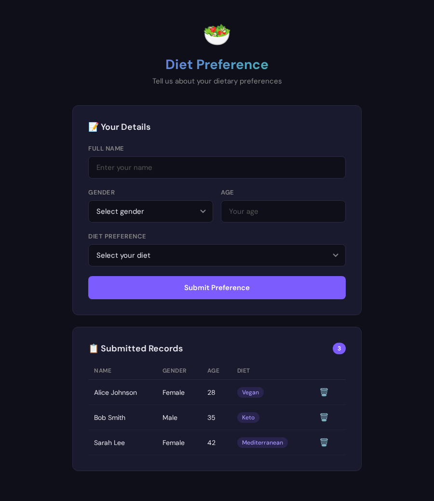
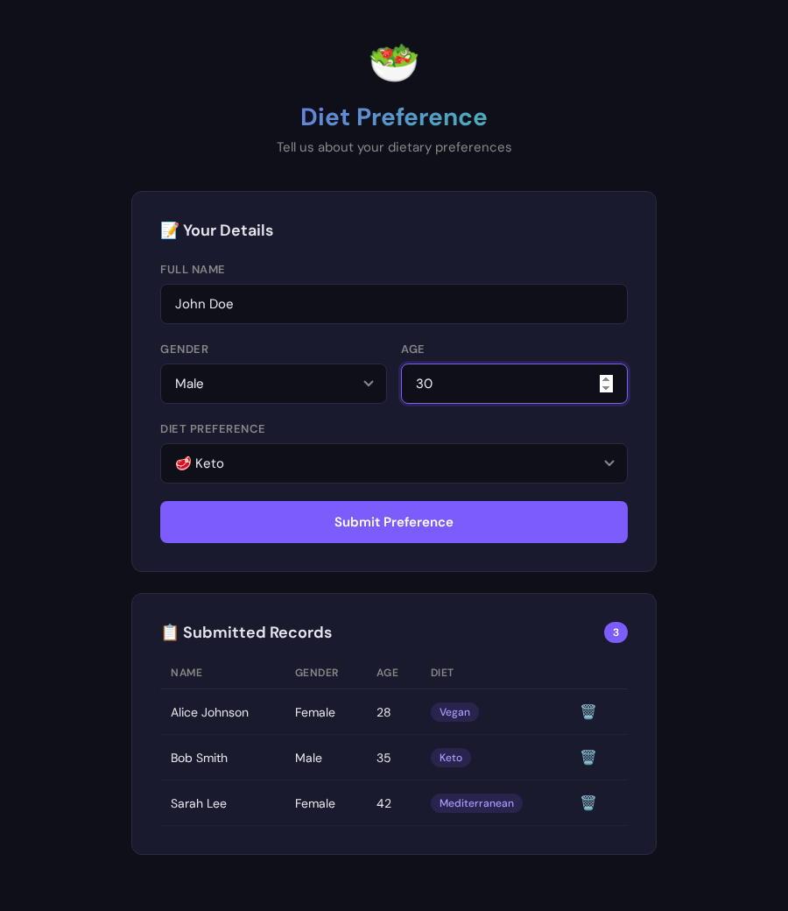
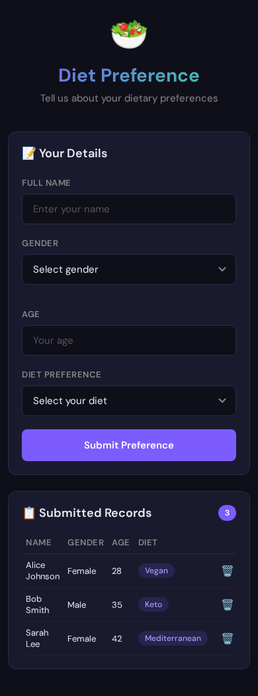

# 🥗 Diet Preference

<div align="center">


**A diet preference form app that saves user data to a Neon PostgreSQL database.**

[🔗 **Live Demo**](https://alfredang--diet-preference-web.modal.run/)

</div>

---

## 📸 Screenshots

<div align="center">

| Form | Filled Form | Mobile |
|:---:|:---:|:---:|
|  |  |  |

</div>

## ✨ Features

- **Clean form UI** — Name, Gender, Age, Diet Preference fields
- **10 diet options** — Vegan, Vegetarian, Keto, Paleo, Mediterranean, Low-Carb, Gluten-Free, Halal, Kosher, No Preference
- **Neon PostgreSQL** — data persisted in cloud database
- **Records table** — view all submitted preferences with delete option
- **Server-side validation** — all inputs validated before database insert
- **Toast notifications** — success/error feedback
- **Dark theme** — sleek purple-accented UI
- **Mobile responsive** — works on any screen size
- **Loading states** — spinner on submit button

## 🖼️ Tech Stack

| Technology | Purpose |
|-----------|---------|
| Python + FastAPI | Backend API server |
| PostgreSQL (Neon) | Cloud database |
| Modal | Serverless deployment |
| Vanilla JavaScript | Frontend logic |
| HTML5 + CSS3 | Dark theme UI |

## 🏗️ Architecture

```
diet-preference/
├── server.js           # Express API + DB connection
├── public/
│   └── index.html      # Frontend (form + records table)
├── .env.example        # Environment variable template
├── screenshots/        # App screenshots
├── package.json
└── README.md
```

## 🔌 API Endpoints

| Method | Endpoint | Description |
|--------|----------|-------------|
| `GET` | `/api/preferences` | Get all diet preferences |
| `POST` | `/api/preferences` | Submit a new preference |
| `DELETE` | `/api/preferences/:id` | Delete a preference |

### POST Body

```json
{
  "name": "John Doe",
  "gender": "Male",
  "age": 30,
  "diet_preference": "Keto"
}
```

## 🚀 Getting Started

```bash
# Clone the repo
git clone https://github.com/alfredang/diet-preference.git
cd diet-preference

# Install dependencies
npm install

# Set up environment variables
cp .env.example .env
# Edit .env with your Neon database URL

# Start the server
npm start
```

The app will be running at `http://localhost:3000`.

### Database Setup

1. Create a free database at [neon.tech](https://neon.tech)
2. Copy the connection string
3. Paste it in your `.env` file as `DATABASE_URL`
4. The table is auto-created on first run

## 📝 License

MIT
